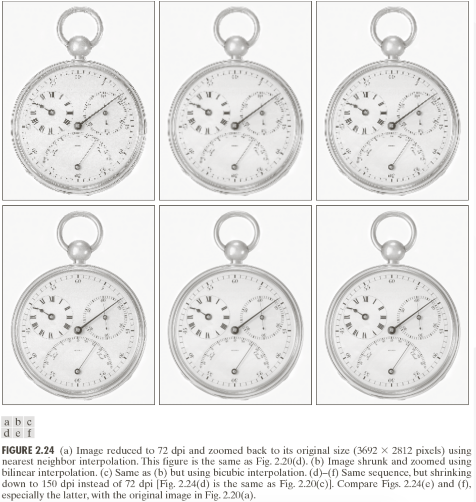
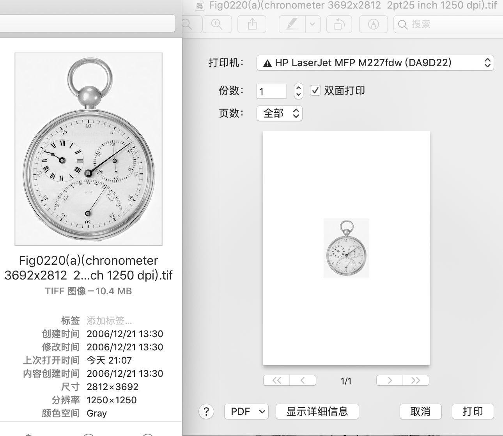
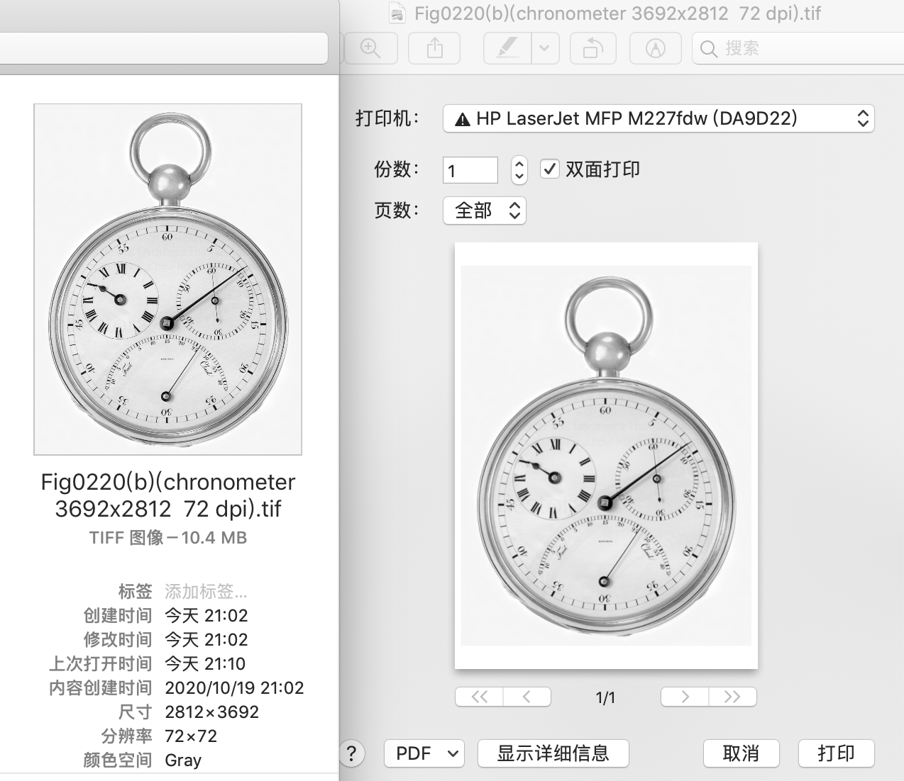
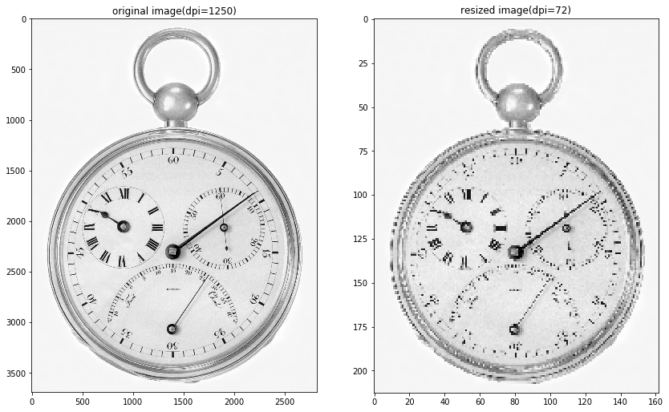
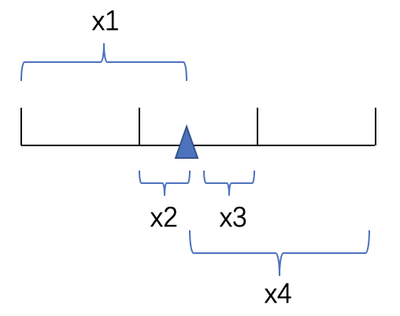
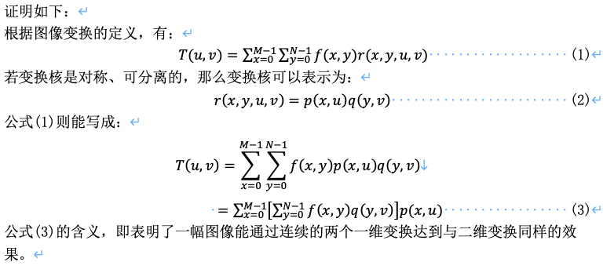

# Problems
- Write a program for implementing image interpolation algorithms
- Write a program for implementing Image Averaging
- Show that 2-D transform with separable, symmetric kernels can be computed by (1) computing 1-D transform along the individual rows(columns) of the input, followed by (2) computing 1-D transforms along the columns(rows) of the result from step(1)

## 插值
课件中展示插值的例子如下。根据图中的文字描述可知，首先将一副图像的dpi缩小（提供的原图dpi为1250），然后尺寸由不同的插值算法扩大至与原图尺寸一致，由此来比较插值算法的效果。
<p align="center">
  
</p>
（以下均为个人理解，有误望指出！）但是根据实验，发现在数字图像中单纯通过改变dpi根本无法对图像尺寸（像素个数）有任何影响，实验程序如下：

```python
# 例如，直接用api可以改变图像dpi
im1250 = Image.open('images/Fig0220(a)(chronometer 3692x2812  2pt25 inch 1250 dpi).tif')
meta_dict = {TAGS[key] : im1250.tag[key] for key in im1250.tag.keys()}
print('original image dpi',meta_dict['XResolution'][0][0]/meta_dict['XResolution'][0][1]) # 输出：1250

# 更改dpi信息并储存
im1250.save("images/Fig0220(b)(chronometer 3692x2812  72 dpi).tif", dpi=(72,72))
im72 = Image.open('images/Fig0220(b)(chronometer 3692x2812  72 dpi).tif')
meta_dict2 = {TAGS[key] : im72.tag[key] for key in im72.tag.keys()}
print('changed image dpi',meta_dict2['XResolution'][0][0]/meta_dict2['XResolution'][0][1]) # 输出：72

# 两个图片在电子设备中，没有太多差异，只是在打印时，dpi高的那幅图物理尺寸会更小
```
两幅具有不同dpi，其余属性一致的图像打印预览结果如下(上：dpi=1250，下：dpi=72)：
<p align="center">
  
</p>
<p align="center">
  
</p>
因此，根据实验推测，课件中所描述的dpi，应该不是纯粹的dots per inch，而更接近于pixels per inch(ppi)。为了模拟课件中的效果，采用如下策略得到dpi不同的图像B（图像A指代原图) 

``` 
令 图A物理尺寸=图B物理尺寸

则有：
number of pixels of FigA's row/dpi of FigA
=
number of pixels of FigB's row/dpi of FigB

带入已知参数：
number of pixels of FigA's row/72
=
2812/1250

得到：
number of pixels of FigA's row = 72*(2812/1250)=213 pixels
(number of pixels of FigA's column同理
= 72*(3692/1250)=162 pixels)
```
实验程序如下：
```python
img_resize1 = im1250.resize((162,213))
img_resize1.save('images/test.tif')# 直接保存不会有dpi信息（即分辨率信息）,也进一步验证，在数字图像中，dpi对显示并不重要
img_resize1.save('images/Fig0220(c)(chronometer 213x162  72 dpi).tif',dpi=(72,72))
```
处理后的结果为：
<p align="center">
  
</p>
后续的插值算法即使用上述步骤产生的模拟图片演示效果（注：虽然模拟图片也使用了resize进行插值得到，但暂时先忽略这个问题，假装这些图片是自然存在的）

### 最邻近插值
最邻近插值网上有很多博客，也很容易理解，此处不在赘述。  
Python代码如下：
```python
"""最邻近插值"""
def my_nearest_interp(image, output_shape): 
    output = np.zeros(output_shape, dtype=image.dtype)
    ratio_height = image.shape[0]*1.0/output_shape[0]
    ratio_width = image.shape[1]*1.0/output_shape[1]
    # 遍历目标图片
    for c in range(output.shape[-1]):
        for row in range(output.shape[0]):
            for col in range(output.shape[1]):

                # 获取其在原图像上的坐标位置
                origin_row = row*ratio_height 
                origin_col = col*ratio_width           

                # 获取其最临近的点
                a = min(max(int(round(origin_row)),0),image.shape[0]-1)
                b = min(max(int(round(origin_col)),0),image.shape[1]-1)

                output[row,col,c] = image[a,b,c]
    return output
```
### 双线性插值
Python代码如下：
```python
"""双线性插值"""
def my_bilinear_interp(image, output_shape): 
    output = np.zeros(output_shape, dtype=image.dtype)
    ratio_height = image.shape[0]*1.0/output_shape[0]
    ratio_width = image.shape[1]*1.0/output_shape[1]
    # 遍历目标图片
    for ch in range(output.shape[-1]):
        for row in range(output.shape[0]):
            for col in range(output.shape[1]):
                # 获取其在原图像上的坐标位置
                origin_row = (row+0.5)*ratio_height - 0.5 # 需要进行中心对齐
                origin_col = (col+0.5)*ratio_width - 0.5
                # 获取其临近的四个点
                a = int(max(0,math.floor(origin_row)))
                b = int(max(0,math.floor(origin_col)))
                c = int(min(image.shape[0]-1,math.ceil(origin_row)))
                d = int(min(image.shape[1]-1,math.ceil(origin_col)))
                #print(a,b,c,d)
                # 双线性插值函数
                interp_value = image[a,b,ch]*(c-origin_row)*(d-origin_col)+image[a,d,ch]*(c-origin_row)*(origin_col-b)+image[c,b,ch]*(origin_row-a)*(d-origin_col)+image[c,d,ch]*(origin_row-a)*(origin_col-b)
                output[row,col,ch] = interp_value
    return output
```
### 双三次插值
参考：https://dailc.github.io/2017/11/01/imageprocess_bicubicinterpolation.html  
双三次插值简单来说就是通过某点周围的16个点，基于某个三次函数计算每个点贡献权重，进行插值得到。
在代码实现时，需要注意对边界填充，由于双三次插值会涉及16个点，因此边界需要填充两个像素。  
注：代码中x1-x4的含义参考下图，y1-y4同理。三角形代表需要计算值的那个点。
<p align="center">
  
</p>

Python代码如下：
```python
"""双三次插值"""
def u(s,a):
    if (abs(s) >=0) & (abs(s) <=1):
        return (a+2)*(abs(s)**3)-(a+3)*(abs(s)**2)+1
    elif (abs(s) > 1) & (abs(s) <= 2):
        return a*(abs(s)**3)-(5*a)*(abs(s)**2)+(8*a)*abs(s)-4*a
    return 0

def padding(img,H,W,C):
    zimg = np.zeros((H+4,W+4,C))
    zimg[2:H+2,2:W+2,:C] = img
    #Pad the first/last two col and row
    zimg[2:H+2,0:2,:C]=img[:,0:1,:C]
    zimg[H+2:H+4,2:W+2,:]=img[H-1:H,:,:]
    zimg[2:H+2,W+2:W+4,:]=img[:,W-1:W,:]
    zimg[0:2,2:W+2,:C]=img[0:1,:,:C]
    #Pad the missing eight points
    zimg[0:2,0:2,:C]=img[0,0,:C]
    zimg[H+2:H+4,0:2,:C]=img[H-1,0,:C]
    zimg[H+2:H+4,W+2:W+4,:C]=img[H-1,W-1,:C]
    zimg[0:2,W+2:W+4,:C]=img[0,W-1,:C]
    return zimg

def my_bicubic_interp(img, output_shape,a):
    #Get image size
    H,W,C = img.shape
    # 首先需要进行填充，才能对图像的边缘部分进行插值
    img = padding(img,H,W,C)
    #Create new image
    dst = np.zeros((output_shape[0], output_shape[1], output_shape[2]))
    
    ratio_height = image.shape[0]*1.0/output_shape[0]
    ratio_width = image.shape[1]*1.0/output_shape[1]
    
    
    for c in range(output_shape[2]):
        for j in range(output_shape[0]):
            for i in range(output_shape[1]):
                # 输出图像在原图像上对应的坐标（加2是因为原图已做了padding）
                x, y = i * ratio_width + 2 , j * ratio_height + 2
                # 注意：x1-x4,y1-y4为目标点P周围16个点距P的距离
                x1 = 1 + x - math.floor(x)
                x2 = x - math.floor(x)
                x3 = math.floor(x) + 1 - x
                x4 = math.floor(x) + 2 - x

                y1 = 1 + y - math.floor(y)
                y2 = y - math.floor(y)
                y3 = math.floor(y) + 1 - y
                y4 = math.floor(y) + 2 - y

                mat_l = np.matrix([[u(x1,a),u(x2,a),u(x3,a),u(x4,a)]])
                mat_m = np.matrix([[img[int(y-y1),int(x-x1),c],img[int(y-y2),int(x-x1),c],img[int(y+y3),int(x-x1),c],img[int(y+y4),int(x-x1),c]],
                                   [img[int(y-y1),int(x-x2),c],img[int(y-y2),int(x-x2),c],img[int(y+y3),int(x-x2),c],img[int(y+y4),int(x-x2),c]],
                                   [img[int(y-y1),int(x+x3),c],img[int(y-y2),int(x+x3),c],img[int(y+y3),int(x+x3),c],img[int(y+y4),int(x+x3),c]],
                                   [img[int(y-y1),int(x+x4),c],img[int(y-y2),int(x+x4),c],img[int(y+y3),int(x+x4),c],img[int(y+y4),int(x+x4),c]]])
                mat_r = np.matrix([[u(y1,a)],[u(y2,a)],[u(y3,a)],[u(y4,a)]])
                dst[j, i, c] = np.dot(np.dot(mat_l, mat_m),mat_r)
    return dst
```

## 图像平均
假设一副有噪声的图像可以表示为：  
<p align="center">
<a href="https://www.codecogs.com/eqnedit.php?latex=g(x,y)&space;=&space;f(x,y)&plus;\eta(x,y)" target="_blank"></a> 
</p> 
<a href="https://www.codecogs.com/eqnedit.php?latex=f(x,y)" target="_blank"></a>为无噪声的理想图片，<a href="https://www.codecogs.com/eqnedit.php?latex=\eta(x,y)" target="_blank"></a>为噪声。并且噪声是假设具有零均值、互不依赖的变量。

假设我们对同一处景象获取到了一系列带有噪声的图片<a href="https://www.codecogs.com/eqnedit.php?latex=g_i" target="_blank"></a>，我们计算这些图片的平均值：
<p align="center">
<a href="https://www.codecogs.com/eqnedit.php?latex=\bar{g}(x,y)=\frac{1}{M}\sum_{M}^{i=1}g_i(x,y)=\frac{1}{M}\sum_{M}^{i=1}[f(x,y)&plus;\eta_i(x,y)]=f(x,y)&plus;\frac{1}{M}\sum_{M}^{i=1}\eta_i(x,y)" target="_blank"></a>
</p>
当M趋近于无穷大时：
<p align="center">
<a href="https://www.codecogs.com/eqnedit.php?latex=\frac{1}{M}\sum_{M}^{i=1}\eta_i(x,y)\rightarrow&space;0&space;,&space;\therefore&space;\bar{g}(x,y)\rightarrow&space;f(x,y)" target="_blank"></a>
</p>
因此，图像平均操作能用来消除噪声

Python代码如下：

```python
"""
给图像创建均值为0的高斯噪声
"""
def add_noise(image):
    row,col= image.shape
    mean = 0
    var = 0.1
    sigma = var**0.5
    gauss = np.random.normal(mean,sigma,(row,col))
    gauss = gauss.reshape(row,col)
    noisy = image + gauss
    return noisy

def image_averaging(noise_images):
    final_image = np.zeros_like(noise_images[0],float)
    for i in range(len(noise_images)):        
        final_image += noise_images[i]
    final_image /= len(noise_images)
    return final_image

def result_show(image,noise,averaged):
    ax = []
    fig=plt.figure(figsize=(14, 14))
    ax.append(fig.add_subplot(1, 3, 1))
    ax[-1].set_title("origin image")
    plt.imshow(image,"gray")
    
    ax.append(fig.add_subplot(1, 3, 2))
    ax[-1].set_title("noise image(random pick)")
    plt.imshow(noise,"gray")
    
    ax.append(fig.add_subplot(1, 3, 3))
    ax[-1].set_title("averaged image")
    plt.imshow(averaged,"gray")
    
    plt.show()

# 读取图像
path = 'images/Fig0226(galaxy_pair_original).tif'
image = cv2.imread(path, 0)
image = image.astype(float)/255.

# 随机给图像生成20张带噪声的
noise_images = []
for i in range(20):
    noise_images.append(add_noise(image))
#随机显示带噪声图像与average之后的图像
averaged = image_averaging(noise_images)

noise_random = noise_images[random.randint(0,len(noise_images))] # random.randint(a,b) generates integer in [a,b]
result_show(image,noise_random,averaged)
```
## 证明
<p align="center">
  
</p>

