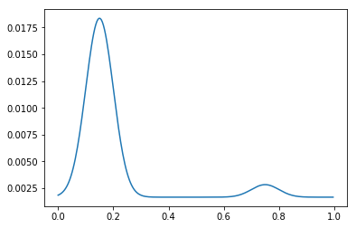

# Problems
- Write a program for implementing image histogram equalization and matching
- Write a program for image intensity transformation, requiring the user can input or choose any transformation functions
- Write a program for spatial filtering so that it can display different results based on all kinds of filters when inputting an original image

You had better integrate all programs above to form a small image intensity transformation system with som menus.

## 直方图均衡化
理论参考：https://zhuanlan.zhihu.com/p/44918476 ，此处粗略复述：
  
**涉及变量与函数：**  
输入图像<a href="https://www.codecogs.com/eqnedit.php?latex=A" target="_blank"></a>, 输出图像<a href="https://www.codecogs.com/eqnedit.php?latex=B" target="_blank"></a>, 像素点灰度：<a href="https://www.codecogs.com/eqnedit.php?latex=D" target="_blank"></a>, 直方图分布<a href="https://www.codecogs.com/eqnedit.php?latex=H(D)" target="_blank"></a>, 变换函数<a href="https://www.codecogs.com/eqnedit.php?latex=f" target="_blank"></a>，一幅图中像素点个数<a href="https://www.codecogs.com/eqnedit.php?latex=A_0" target="_blank"></a>, 灰度级别总数L。  
**直方图均衡化目的：**  
找到变换函数 <a href="https://www.codecogs.com/eqnedit.php?latex=D_B&space;=&space;f(D_A)" target="_blank"></a>,使得理想情况下有<a href="https://www.codecogs.com/eqnedit.php?latex=H_B(D)=\frac{A_0}{L}" target="_blank"></a>(即像素均匀地分布在不同灰度级别内)  
**约束条件：**
<p align='center'>
<a href="https://www.codecogs.com/eqnedit.php?latex=\int_0^{D_A}&space;H_A(D)dD=\int_0^{D_B}H_B(D)dD" target="_blank"></a>
</p>

即输入、输出图像在某一区间内像素个数相等。  
**结合上述，可得：**  

<p align='center'>
<a href="https://www.codecogs.com/eqnedit.php?latex=\int_0^{D_A}&space;H_A(D)dD=\frac{A_0}{L}D_B=\frac{A_0}{L}f(D_A)" target="_blank"></a>
</p>

**最终得到所需的f为：**

<p align='center'>
<a href="https://www.codecogs.com/eqnedit.php?latex=f(D_A)=\frac{L}{A_0}\int_0^{D_A}H_A(D)dD" target="_blank"></a>
</p>

工具函数
```python
def show_image_and_hist(image,title1="transformed image",title2="histogram distribution"):
    """
    展示图片与其对应的直方图
    """ 
    ax = []
    fig=plt.figure(figsize=(9, 4))
    ax.append(fig.add_subplot(1, 2, 1))
    ax[-1].set_title(title1)
    plt.imshow(image,cmap='gray')
    
    ax.append(fig.add_subplot(1, 2, 2))
    ax[-1].set_title(title2)
    flatten = image.ravel()
    plt.hist(flatten,np.arange(0,256))
    
    plt.show()
```
关键算法与实验
```python
""" 读入图片(灰度图)"""
path = 'images/Fig0320(4)(bottom_left).tif'
image = cv2.imread(path, 0)
g = cv2.equalizeHist(image)


hist, bins = np.histogram(image.flatten(),256,[0,255])

#cumulative distribution function
cdf = hist.cumsum() 

cdf_m = np.ma.masked_equal(cdf,0)
cdf_m = ((cdf_m - cdf_m.min())*255)/(cdf_m.max() - cdf_m.min())
cdf_scaled = np.ma.filled(cdf_m,0).astype('uint8')

#image2 = np.zeros_like(image)
image2 = cdf_scaled[image].astype('uint8')

#for x in range(image.shape[0]):
#    for y in range(image.shape[1]):
#        image2[x,y] = cdf_scaled[image[x,y]]


#show_image_and_hist(image,title1='original image')
show_image_and_hist(image2,title1='implement eq result')
#show_image_and_hist(g,title1='opencv eq result')
```
<p align="center">
  
</p>

```python
x_values = np.arange(0,256)
y_values = cdf_scaled[x_values].astype('uint8')

plt.title('mapping function')
plt.xlim((0,255))
plt.ylim((0,255))
plt.plot(x_values, y_values)
```
<p align="center">
  
</p>

## 直方图匹配
直方图匹配的思想即将原图r与指定图像z，分别通过直方图均衡化函数T(r)与G(z)变换到均衡化后的图像。因此有

<p align='center'>
<a href="https://www.codecogs.com/eqnedit.php?latex=T(r)=s=G(z)" target="_blank"></a>
</p>

我们的目的是使图像尽可能和指定图像灰度分布接近，因此需要找到变换函数<a href="https://www.codecogs.com/eqnedit.php?latex=G^{-1}(s)" target="_blank"></a>。  

为了与书中效果做对比，复现与书中相同的函数
```python
def generate_two_modes_gaussian(m1,sigma1,m2,sigma2,A1,A2,k):
    c1=A1*(1/((2*math.pi)**0.5)*sigma1)
    k1 = 2*(sigma1**2)
    c2=A2*(1/((2*math.pi)**0.5)*sigma2)
    k2 = 2*(sigma2**2)
    z = np.arange(0.0,1.0,1/256)
    #print(z)
    p = k + c1*np.exp(-((z-m1)**2)/k1)+c2*np.exp(-((z-m2)**2)/k2)
    p = p/np.sum(p)
    return p
```
直方图匹配的关键算法
```python
def find_nearest_above(my_array, target):
    # my_array是指定参考图像直方图均衡化之后的数组
    # target是原图灰度值在直方图均衡化图中对应的灰度值
    diff = my_array - target
    # 布尔数组
    mask = np.ma.less_equal(diff, -1)
    
    if np.all(mask):# 如果target比my_array都大
        c = np.abs(diff).argmin()
        return c # returns min index of the nearest if target is greater than any value
    masked_diff = np.ma.masked_array(diff, mask)
    return masked_diff.argmin()

def hist_match(original, specified_pdf):
 
    oldshape = original.shape
    original = original.ravel()
   
    
    # s_values 返回结果是升序排列的
    s_values, bin_idx, s_counts = np.unique(original, return_inverse=True,return_counts=True)
    
    s_quantiles = np.cumsum(s_counts).astype(np.float64)
    s_quantiles /= s_quantiles[-1]
    
    t_quantiles = np.cumsum(specified_pdf).astype(np.float64)
    t_quantiles /= t_quantiles[-1]
 
    # np.around 0:[0,0.5], 1:(0.5,1]
    sour = np.around(s_quantiles*255)
    temp = np.around(t_quantiles*255)
    #print(sour[:15])
    
    b=[]
    for data in sour[:]:
        b.append(find_nearest_above(temp,data))
    #b就是映射后的灰度级
    b= np.array(b,dtype='uint8')
    # b[bin_idx]相当于逆变换
    return s_values, b, b[bin_idx].reshape(oldshape)
```
实验部分
```python
""" 读入图片(灰度图)"""
path = 'images/Fig0323(a)(mars_moon_phobos).tif'
image = cv2.imread(path, 0)
show_image_and_hist(image)

"""规定的直方图"""
gaussians = generate_two_modes_gaussian(m1=0.15,sigma1=0.05,m2=0.75, sigma2=0.05,A1=1,A2=0.07,k=0.002)
x = np.arange(0,1,1/256)
plt.plot(x,gaussians)
```
<p align="center">
  
</p>
<p align="center">
  
</p>

```python
s_values,mapping, matched_image = hist_match(image, gaussians)
#print(len(mapping))
show_image_and_hist(matched_image)
```

<p align="center">
  
</p>

## 灰度变换
灰度变换所采用的示例图像均来自《数字图像处理》中实验图像，编码也以复现书中涉及的变换函数为主。  
用于展示的工具函数
```python
def show_image_and_transformed(image, transformed):
    """
    展示原图与灰度变换后的图像
    """ 
    ax = []
    fig=plt.figure(figsize=(9, 4))
    ax.append(fig.add_subplot(1, 2, 1))
    ax[-1].set_title("origin image")
    plt.imshow(image,cmap='gray')
    
    ax.append(fig.add_subplot(1, 2, 2))
    ax[-1].set_title("transformed image")
    plt.imshow(transformed,cmap='gray')
    
    plt.show()
```

### 明暗反转
明暗反转有利于增强嵌入在一大片黑色区域中的白色或灰色细节  
Python代码如下：
```python
breast_img = 'images/Fig0304(a)(breast_digital_Xray).tif'
img = cv2.imread(breast_img, 0)

if img.dtype=='uint8':
    img = img.astype('float')/255.
```
```python
negative = 1. - img 
show_image_and_transformed(img, negative)
```
<p align="center">
  
</p

### imadjust
imadjust即将输入图像一定范围内的灰度级映射至输出图像某一范围灰度。而输入图像需要映射的灰度范围可分为两种，一是人为指定，二是基于统计信息自动判断。  
**imadjust实现方式一：人为指定范围**
```python
# ref: https://stackoverflow.com/questions/39767612/what-is-the-equivalent-of-matlabs-imadjust-in-python
# TODO 与imadjust2统一成相同的数据范围
def imadjust(src,a=None,b=None,c=None,d=None,gamma=1):
    # Similar to imadjust in MATLAB.
    # Converts an image range from [a,b] to [c,d].
    # The Equation of a line can be used for this transformation:
    #   y=((d-c)/(b-a))*(x-a)+c
    # However, it is better to use a more generalized equation:
    #   y=((x-a)/(b-a))^gamma*(d-c)+c
    # If gamma is equal to 1, then the line equation is used.
    # When gamma is not equal to 1, then the transformation is not linear.
    assert len(src.shape) == 2 ,'Input image should be 2-dims'
    if np.max(src)>1.0:
        src = src.astype('float')/255.
        
    if not a:
        a = max(np.min(src), 0.)
    if not b:
        b = min(np.max(src), 1.)
    if not c:
        c = 0.
    if not d:
        d = 1.
    # c,d=1,0可以模拟负片效果
    if d>c:
        dst = (((src - a) / (b - a)) ** gamma) * (d - c) + c
    else:
        dst = 1 - (((src - a) / (b - a)) ** gamma) * (c - d) + c
    return dst
```

```python
strecth1 = imadjust(img,0.5,0.75,0,1)
strecth1[strecth1<0]=0
strecth1[strecth1>1]=1
show_image_and_transformed(img, strecth1)
```
<p align="center">
  
</p>

gamma变换
```python
strecth2 = imadjust(img,None,None,None,None,2)
strecth2[strecth2<0]=0
strecth2[strecth2>1]=1
show_image_and_transformed(img, strecth2)
```
<p align="center">
  
</p>

**imadjust实现方式二：自动决定范围**
较为复杂的imadjust实现，可以实现阈值的自动计算，相当于matlab中的imadjust(f,stretchlim(f),[])
```python
# ref:https://stackoverflow.com/questions/39767612/what-is-the-equivalent-of-matlabs-imadjust-in-python
import bisect
def imadjust2(src, tol=1, vin=[0,255], vout=(0,255)):
    # src : input one-layer image (numpy array)
    # tol : tolerance, from 0 to 100.
    # vin  : src image bounds
    # vout : dst image bounds
    # return : output img

    assert len(src.shape) == 2 ,'Input image should be 2-dims'
    if np.max(src)<=1.0:
        src = (src*255).astype('uint8')
    

    tol = max(0, min(100, tol))

    if tol > 0:#当该参数不为0时，自动计算图像灰度级的顶部和底部tol%的像素值作为vin
        # Compute in and out limits
        # Histogram
        hist = np.histogram(src,bins=list(range(257)),range=(0,255))[0]

        # Cumulative histogram
        cum = hist.copy()
        for i in range(1, 256): cum[i] = cum[i - 1] + hist[i]

        # Compute bounds
        total = src.shape[0] * src.shape[1]
        low_bound = total * tol / 100
        upp_bound = total * (100 - tol) / 100
        vin[0] = bisect.bisect_left(cum, low_bound)
        vin[1] = bisect.bisect_left(cum, upp_bound)
        print(vin)

    # Stretching
    
    vs = src-vin[0]
    vs[src<vin[0]]=0
    if vout[1]>vout[0]:
        scale = (vout[1] - vout[0]) / (vin[1] - vin[0])
        vd = vs*scale+0.5 + vout[0]
        vd[vd>vout[1]] = vout[1]
        dst = vd
    else:
        scale = (vout[0] - vout[1]) / (vin[1] - vin[0])
        vd = vs*scale+0.5 + vout[1]
        vd[vd>vout[0]] = vout[0]
        dst = 255 - vd
    return dst
```
```python
strecth3 = imadjust2(img)
show_image_and_transformed(img, strecth3)
```
<p align="center">
  
</p>

```python
strecth4 = imadjust2(img,1,[0,255],(255,0))# 负片效果
show_image_and_transformed(img, strecth4)
```

<p align="center">
  
</p>

### 对数变换
```python
img = cv2.imread(breast_img,0)
# 由于傅立叶变换在第四章才接触，因此此处还是使用已有api实现傅立叶变换
# 在第四章将自己实现傅立叶变换
f = np.fft.fft2(img)
fshift = np.fft.fftshift(f)
fshift = fshift + 1e-7# 避免负数过小
#print(np.max(fshift))
#print(np.min(fshift))

def normalize(img, target_min=0, target_max=1):
    imin,imax = np.min(img), np.max(img)
    scale = (target_max - target_min) / (imax - imin)
    dst = img*scale + target_min
    dst[dst>target_max] = target_max
    return dst
  c = 1 # c一般取1.0

g = c*(np.log(1 + fshift))
print(np.max(g))
g = normalize(g, 0, 1)
print(np.max(g))
# 频谱是复数
show_image_and_transformed(normalize(fshift).astype('float'), g.astype('float'))
```
<p align="center">
  
</p>

## 自定义变换函数
```python
breast_img = 'images/Fig0304(a)(breast_digital_Xray).tif'
img = cv2.imread(breast_img, 0)
def pixelVal(pix, r1, s1, r2, s2): 
    if (0 <= pix and pix <= r1): 
        return (s1 / r1)*pix 
    elif (r1 < pix and pix <= r2): 
        return ((s2 - s1)/(r2 - r1)) * (pix - r1) + s1 
    else: 
        return ((255 - s2)/(255 - r2)) * (pix - r2) + s2 

r1 = 70
s1 = 0
r2 = 140
s2 = 60
  
# 类似于pandas的apply，可以将函数应用在数组的每一个元素上
pixelVal_vec = np.vectorize(pixelVal) 
  
# Apply contrast stretching. 
contrast_stretched = pixelVal_vec(img, r1, s1, r2, s2) 
contrast_stretched =  np.array(contrast_stretched, dtype='uint8')
#print(np.unique(img))
#print(np.unique(contrast_stretched))
# 注意用plt的话，对于0-255范围的数需要转化为整形，否则浮点数默认范围是0-1
show_image_and_transformed(img, np.array(contrast_stretched, dtype='uint8'))

x_index = np.arange(0,256)
plt.plot(x_index,pixelVal_vec(x_index,r1, s1, r2, s2))
```
<p align="center">
  
</p>
<p align="center">
  
</p>

## 空间滤波
（第四章会有更多关于滤波器的内容，因此此处并未做展示）
