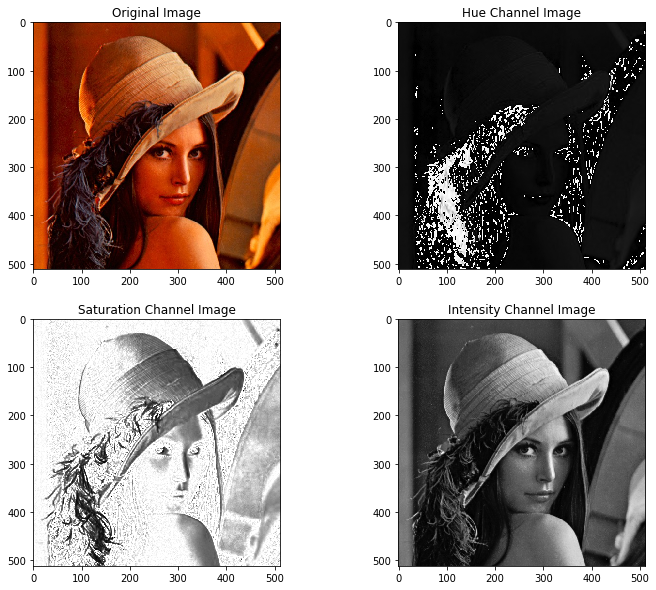
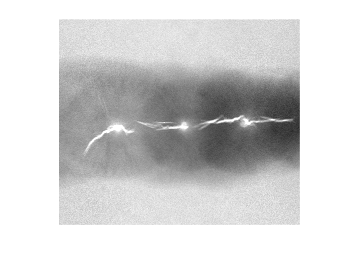
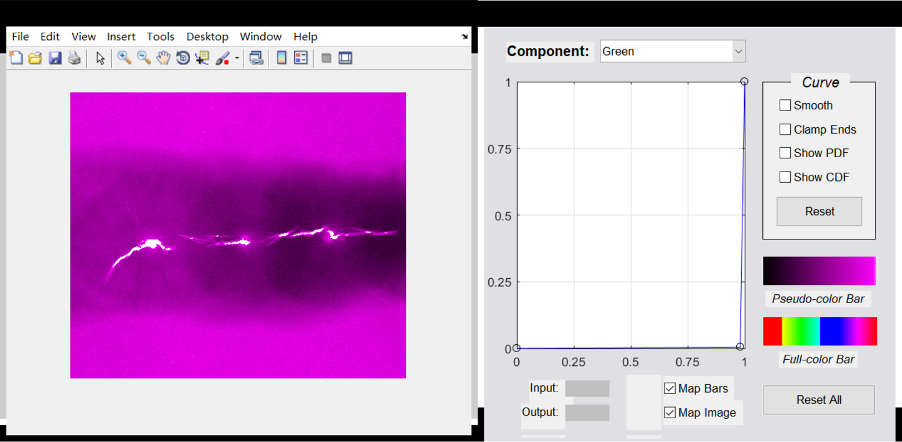
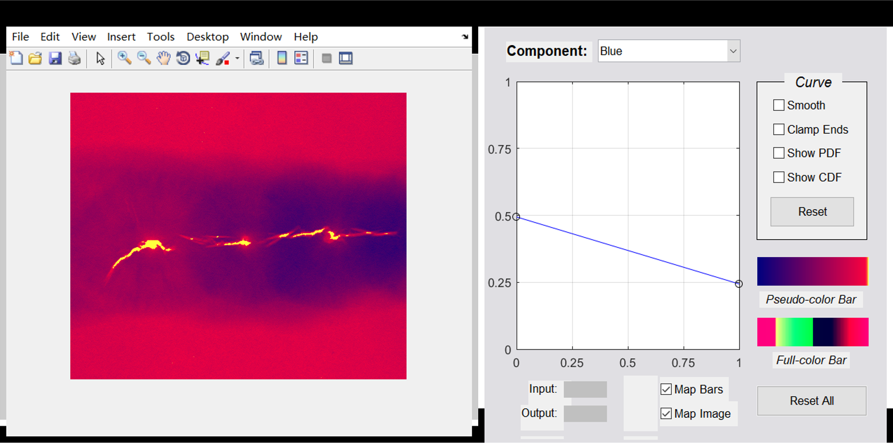
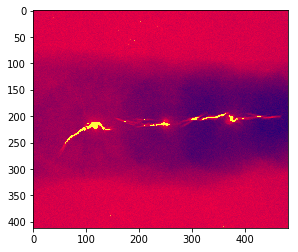
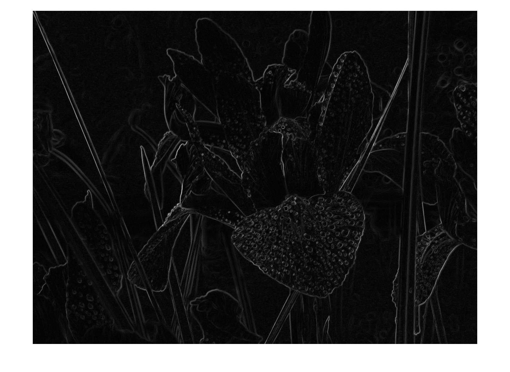
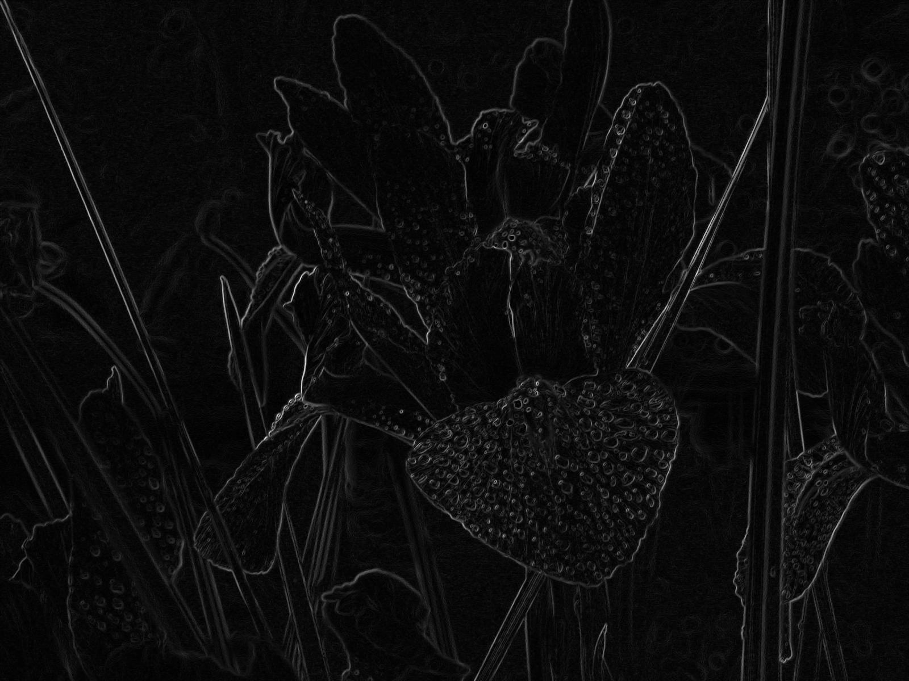
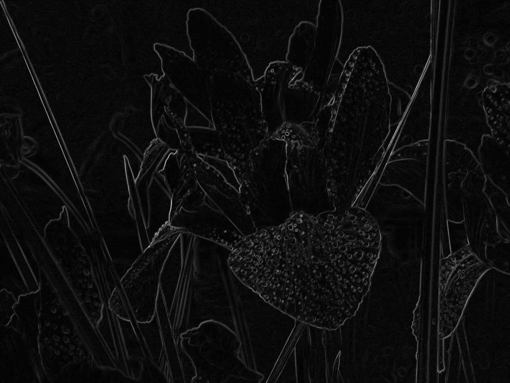

# Problems
Take a color picture, program for it to get following results,
- Its Red, Green and Blue image respectively
- Its Hue, Saturation and Intensity image respectively
- Do pseudo-color image processing(assign different colors for different gray levels)
- Detect all adges in the color picture

## R,G,B通道
```python
img = plt.imread('images/Fig0646(a)(lenna_original_RGB).tif')

r = img[:,:,0]
g = img[:,:,1]
b = img[:,:,2]
```

## H,S,I通道


$$
I=\frac{1}{3}(R+G+B)
$$

$$
S=1-\frac{3}{R+G+B}[min(R,G,B)]
$$

$$
H=\begin{cases}
 \theta &  B\leqslant G \\ 
 360^{\circ}-\theta & B> G 
\end{cases}
$$

式中
$$
\theta=arccos\left \{ \frac{\frac{1}{2}[(R-G)+(R-B)]}{[(R-G)^2+(R-B)(G-B)]^\frac{1}{2}} \right \}
$$
<a href="https://www.codecogs.com/eqnedit.php?latex=\theta=arccos\left&space;\{&space;\frac{\frac{1}{2}[(R-G)&plus;&space;(R-B)]}{[(R-G)^2&plus;(R-B)(G-B)]^\frac{1}{2}}&space;\right&space;\}" target="_blank"></a>

```python
# 参考：https://github.com/SVLaursen/Python-RGB-to-HSI/blob/master/converter.py
#Calculate Intensity
def calc_intensity(red, blue, green):
    return np.divide(blue + green + red, 3)

#Calculate Saturation
def calc_saturation(red, blue, green):
    minimum = np.minimum(np.minimum(red, green), blue)
    saturation = 1 - (3 / (red + green + blue + 0.001) * minimum)

    return saturation

#Calculate Hue
def calc_hue(red, blue, green):
    with np.errstate(divide='ignore', invalid='ignore'):
        hue = np.copy(red)
        for i in range(0, blue.shape[0]):
            for j in range(0, blue.shape[1]):
                hue[i][j] = 0.5 * ((red[i][j] - green[i][j]) + (red[i][j] - blue[i][j])) / \
                            math.sqrt((red[i][j] - green[i][j])**2 +
                                    ((red[i][j] - blue[i][j]) * (green[i][j] - blue[i][j]))+1e-8)
                
                hue[i][j] = math.acos(hue[i][j])
               
                if blue[i][j] <= green[i][j]:
                    hue[i][j] = hue[i][j]
                else:
                    hue[i][j] = ((360 * math.pi) / 180.0) - hue[i][j]
                
                

        return hue
img = plt.imread('images/Fig0646(a)(lenna_original_RGB).tif')
# 注意计算前须归一化到[0-1]
r = img[:,:,0].astype('float')/255.
g = img[:,:,1].astype('float')/255.
b = img[:,:,2].astype('float')/255.

h,s,i = calc_hue(r,b,g),calc_saturation(r,b,g),calc_intensity(r,b,g)
h = h/((360 * math.pi) / 180.0) # 最后的h需要除360度，其余的s,i已经在[0-1]之内

# Display results
display = [img, h, s, i]
label = ['Original Image', 'Hue Channel Image', 'Saturation Channel Image', 'Intensity Channel Image']

fig = plt.figure(figsize=(12, 10))

for i in range(len(display)):
    fig.add_subplot(2, 2, i+1)
    if i>0:
        plt.imshow(display[i],'gray')
    else:
         plt.imshow(display[i])
    plt.title(label[i])

plt.show()
```
<p align="center">
  
</p>

## 伪彩色映射
在RGB彩色空间中表示一副单色图像且对结果分量分别映射时，变换结果是一副伪彩色图像。其方程形式为：
$$s_i=T_i(r),i=1,2,...,n$$
式中，r表示灰度级的值，$T_i$是映射函数，$s_i$是输出图像的彩色分量，$n$是$r_i$彩色空间的维数。输入图像的灰度级已被指定的彩色代替。做这些变换的意义在于：人眼对灰度的辨识度不如彩色，因此伪彩色映射常用于产生较小的灰度级变化，以使人眼看得见，或突出重要的灰度级区域。

**本节工作**  
在《数字图像处理》一书中，通过Matlab的交互式颜色编辑界面完成伪彩色映射，对此，本文首先在Matlab中得到书中结果，并用python硬编码复现，主要学习如何映射。

注：  
1、 测试图片下载地址：http://www.imageprocessingplace.com/DIP-3E/dip3e_book_images_downloads.htm 其中的第六章
2、 ice.m与ice.fig下载地址：http://fourier.eng.hmc.edu/e161/dipum/

测试灰度图片为：
<p align="center">
  
</p>

### Matlab重现
在matlab中，输入以下命令，可得到一副图像窗口与交互式编辑窗口
```matlab
f = imread('Fig0621(a)(weld-original).tif');
g = ice('image',f);
```
第一步：先选定Green通道，然后shift+鼠标左键（windows中）在编辑窗口中增加一个控制点，并将控制点移至0.95处左右，可得到如下图所示结果。
<p align="center">
  
</p>

第二步：先选定Blue通道，然后在编辑窗口中将左右边界的两个控制点分别移至(0,0.5)与(1,0.25)处，可得到下图结果。
<p align="center">
  
</p>

### Python硬编码复现
用python硬编码变换函数，可发现结果与matlab中的一致。
```python
def pixelVal(pix, r1, s1): 
    if (0 <= pix and pix <= r1): 
        return 0.0
    elif (pix > r1): 
        return (pix-r1)/(1-r1)
# 类似于pandas的apply，可以将函数应用在数组的每一个元素上 
pixelVal_vec = np.vectorize(pixelVal) 
path = 'images/Fig0621(a)(weld-original).tif'
gray = cv2.imread(path,0)
gray_f = gray.astype('float')/255.

# Blue y=-0.25x+0.5
B = -0.25*gray_f + 0.5
G = pixelVal_vec(gray_f, 0.97, 1)
R = gray_f.copy()

pseudo_rgb = cv2.merge((R,G,B))

plt.imshow(pseudo_rgb)
```
<p align="center">
  
</p>


## 彩色图像边缘检测

首先要注意，**基于各个彩色平面的处理不等于直接在RGB向量空间的处理**，但是对于边缘检测而言，二者的视觉效果相差不大。

**本节工作**  
在《数字图像处理》一书中，已经较为详细的讲明了彩色图像如何检测边缘（与数学有关的推导推荐博客：https://blog.csdn.net/u013921430/article/details/82931206） ，对此，本文首先在Matlab中得到书中结果，并用python复现。

注：  
1、 测试图片下载地址：http://www.imageprocessingplace.com/DIP-3E/dip3e_book_images_downloads.htm 其中的第六章
2、 colorgrad.m下载地址：http://fourier.eng.hmc.edu/e161/dipum/

首先是复现colorgrad.m中的```imfilter(double(f(:, :, 1)), sh, 'replicate');```函数
经过对比实验，发现replicate的效果相当于仅用最外的边界复制填充。python代码如下：
```python
def conv2d(img, kernel):  
    m, n = kernel.shape
    if (m == n):
        border = (m-1)//2
        # replicate 应该是先将图片扩大了后，再进行卷积
       
        y, x = img.shape
        # 其实matlab中imfilter的replicate模式就相当于使用最外层的edge进行填充
        # 四个顶点也仅使用了原图的最外围点
        new_image = np.pad(img, pad_width=border, mode='edge')
        """
        # 自己实现，帮助理解
        new_image = np.zeros((y+m-1,x+m-1))
        y = y+m-1
        x = x+m-1
        #print(new_image.shape)
        new_image[border:y-border,border:x-border] = img
        print(new_image)
        # 复制前几行
        new_image[0:border,border:x-border]=img[0,:].reshape(1,-1)
        # 复制后几行
        new_image[y-border:,border:x-border]=img[-1,:].reshape(1,-1)
        # 复制前几列
        new_image[border:y-border,:border]=img[:,0].reshape(-1,1)
        # 复制后几列
        new_image[border:y-border,x-border:]=img[:,-1].reshape(-1,1)
        # 复制四个顶点
        new_image[0:border,0:border]=img[0,0]#左上角
        new_image[y-border:,0:border]=img[-1,0]#左下角
        new_image[0:border,x-border:]=img[0,-1]#右上角
        new_image[y-border:,x-border:]=img[-1,-1]#右下角
        return new_image
        """
        result = np.zeros_like(img,dtype=img.dtype)
        for i in range(y):  
            for j in range(x):
                result[i][j] = \
                np.sum(new_image[i:i+m, j:j+m]*kernel)
        
    return result

def imfilter(img, kernel):
    img = np.asarray(img,'float')
    return conv2d(img, kernel)
```

### 方式一：基于各个彩色平面的处理
Matlab的处理结果为：
<p align="center">
  
</p>


Python复现
```python
img = cv2.imread('images/Fig0651(a)(flower_no_compression).tif')
sh = np.array([[1,2,1],[0,0,0],[-1,-2,-1]])
sv = sh.T


B,G,R = cv2.split(img)

# 经过验证，与matlab中imfilter结果一致
Rx = imfilter(R,sh)
Ry = imfilter(R,sv)
Gx = imfilter(G,sh)
Gy = imfilter(G,sv)
Bx = imfilter(B,sh)
By = imfilter(B,sv)

grad = np.sqrt(np.square(Rx) + np.square(Ry)) +\
        np.sqrt(np.square(Gx) + np.square(Gy)) + \
        np.sqrt(np.square(Bx) + np.square(By))
grad = ((grad - grad.min()) / (grad.max() - grad.min())) * 255 # rescale for full dynamic range for 8 bit image
grad = grad.astype(np.uint8)
cv2.imwrite('images/flower_gradient_direct_python.png',grad)
```
Python处理的结果为:
<p align="center">
  
</p>

### 方式二：直接在RGB向量空间的处理
Matlab的处理结果为：
<p align="center">
  
</p>

Python复现
```python
img = cv2.imread('images/Fig0651(a)(flower_no_compression).tif')
sh = np.array([[1,2,1],[0,0,0],[-1,-2,-1]])
sv = sh.T


B,G,R = cv2.split(img)

# 经过验证，与matlab中imfilter结果一致
Rx = imfilter(R,sh)
Ry = imfilter(R,sv)
Gx = imfilter(G,sh)
Gy = imfilter(G,sv)
Bx = imfilter(B,sh)
By = imfilter(B,sv)

# 不要用np.power,比a**2,a*a慢很多
gxx = Rx**2 + Gx**2 + Bx**2
gyy = Ry**2 + Gy**2 + By**2
# np.multiply and the multiplication operator * work consistently for ndarray objects.
# 对于matrix对象才会有区别
gxy = Rx*Ry + Gx*Gy + Bx*By

eps = np.finfo(float).eps # 等于matlab中的eps
A = 0.5*(np.arctan(2*gxy/(gxx - gyy + eps)))
# G1,G2的计算结果与matlab中有些许区别
# 且matlab对负数开方，会直接转换为复数
# python中我们另作处理，否则后续在比较大小时会出现问题
G1 = 0.5*((gxx + gyy) + (gxx - gyy)*np.cos(2*A) + 2*gxy*np.sin(2*A));
G1[G1<0]=0

# Now repeat for angle + pi/2. Then select the maximum at each point.
A = A + pi/2
G2 = 0.5*((gxx + gyy) + (gxx - gyy)*np.cos(2*A) + 2*gxy*np.sin(2*A));
G2[G2<0]=0

G1 = G1**0.5
G2 = G2**0.5
# Form VG by picking the maximum at each (x,y) and then scale
# to the range [0, 1].
VG = np.maximum(G1, G2)
# 将范围缩放至[0-1]
VG = (VG -np.min(VG))/(np.max(VG)-np.min(VG))

cv2.imwrite('images/flower_gradient_python.png',(VG*255).astype('uint8'))
```
Python处理的结果为:
<p align="center">
  
</p>

